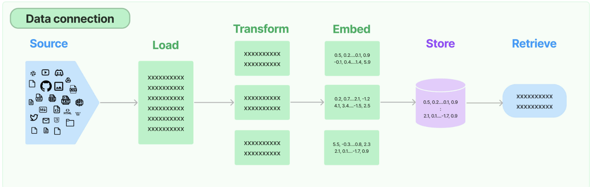

# Natural Language chat with a Website from URL - LangChain Chatbot with Streamlit UI (Faiss Vector Indexing, OpenAI Embeddings)

Welcome to the GitHub repository for the Natural Language Chatbot with Streamlit UI!

## Features
- **Website Interaction**: The chatbot uses the latest version of LangChain to interact with and extract information from various websites.
- **Large Language Model Integration**: Compatibility with models like GPT-4, Mistral, Llama2, and ollama. In this code I am using GPT-4, but you can change it to any other model.
- **Streamlit GUI**: A clean and intuitive user interface built with Streamlit, making it accessible for users with varying levels of technical expertise.
- **Python-based**: Entirely coded in Python.

## Retrieval-Augmented Generation (RAG) Overview

RAG, or Retrieval-Augmented Generation, enhances the language model's knowledge by augmenting it with additional information. The process involves vectorizing relevant text, identifying the most similar content to augment the prompt, and passing this text as a prefix to the language model.

Here is a diagram that shows the process:



## Installation
Ensure you have Python installed on your system. Then clone this repository:

```bash
git clone [repository-link]
cd [repository-directory]
```

Install the required packages:

```bash
pip install -r requirements.txt
```

Create your own .env file with the following variables:

```bash
OPENAI_API_KEY=[your-openai-api-key]
```

## Usage
To run the Streamlit app:

```bash
streamlit run app.py
```

---

Happy Coding! 🚀👨‍💻🤖

---

*Don't forget to star this repo if you find it useful!*

---